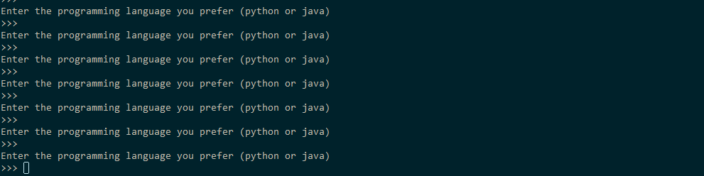

#  AutoCoder

#### A basic and simple tool for code auto completion, fine-tuned from the pytorch [pre-trained GPT-2 variants](https://huggingface.co/transformers/pretrained_models.html) offered by the awesome [🤗 transformers](https://github.com/huggingface/transformers) library.

### Demo


### Features
- Write with Python or Java.


### Quick Start
Here provides two ways of quick-start. Before that,
```
git clone <this repository>
pip install -r requirements.txt
```

#### Ready-to-go Interaction
1. Download the fine-tuned models, here are two versions provided.
    * [distilgpt2_fine_tuned_coder (params: 82M, size: 291MB)](https://ucdcs-student.ucd.ie/~cwang/autocoder/distilgpt2_fine_tuned_coder.zip)
    * [gpt2_medium_fine_tuned_coder.zip (params: 345M, size: 1.22GB)](https://ucdcs-student.ucd.ie/~cwang/autocoder/gpt2_medium_fine_tuned_coder.zip)
2. Unzip the model and move it to `./model` (create it first)
3. Run the interact: `python interact.py`

#### Fine-tuning yours

1. Preparing [the dataset](./dataset)
2. Start fine-tuning model: `python train.py --model_select distilgpt2` 

\* For more params setting of training, `python train.py -h`

### Generative examples
Good Python generation examples by fine-tuned GPT2-medium
```python
-------------Example 1--------------------------------------
Context code: def factorial
Generated: 
def factorial(n):
    return 1 if n == 1 else n * factorial(n - 1)

--------------Example 2-------------------------------------
Context code: def sum_of_series(num_of_terms:int, power: int)
Generated:
def sum_of_series(num_of_terms:int, power: int) -> float:
    """Calculate Sum of Series.
    >>> sum_of_series(1, 1, 10)
    55.0
    >>> sum_of_series(1, 10, 100)
    49600.0
    """
    sum = (num_of_terms / 2) * power
    return sum

--------------Example 3-------------------------------------
Context code: def quick_sort(collection)
Generated:
def quick_sort(collection):
    """
    >>> quick_sort([0, 5, 3, 2, 2])
    [0, 2, 2, 3, 5]
    >>> quick_sort([])
    []
    >>> quick_sort([-2, -5, -45])
    [-45, -5, -2]
    """
    length = len(collection)
    if length <= 1:
        return collection
    else:
        # Use the last element as the first pivot
        pivot = collection.pop()
        # Put elements greater than pivot in greater list
        # Put elements lesser than pivot in lesser list
        greater, lesser = [], []
        for element in collection:
            if element > pivot:
                ...
```
Good Java generation examples by fine-tuned GPT2-medium

```javascript
--------------Example 1-------------------------------------
Context code: Scanner input= new Scanner(System.in)
Generated:
Scanner input= new Scanner(System.in)
System.out.println("Enter the Octal number: ");
// Take octal number as input from user in a string
String oct = input.next();

--------------Example 2-------------------------------------
Context code: private static int CountCharacters(String str)
Generated:
private static int CountCharacters(String str) {
        return str.replaceAll("\\s", "").length();
}
```
\* Although some generated examples look good, it needs to take a grain of salt to judge the model's actual performance. The model may simply **"remembers"** existing code in the training set well.

### TODO list
- Expand the dataset and increase context window. Try larger generative models like GPT-2 large or even [GPT-3 variants](https://arxiv.org/abs/2005.14165) as proposed recently if the computational resources are allowed.
- Remove overlapping between training examples and dev examples for contamination studies. That says, to what extent the model memorizes examples rigidly or [at surface heuristics level during training](https://arxiv.org/pdf/1902.01007.pdf).
- Try some adversarial examples (more complicated for model's reasoning capability testing purpose) to test the robustness of the model.
- Integrate this into real-life use case such as a code editor - [Sublime Text](https://www.sublimetext.com/)
- Try some ideas of location-aware code generation. For example, if a human coder is sitting writing a comment, the autocoder should be aware of the coder's context (left and right if available) to help complete the corresponding content.


### Blog linked to this project
- [The details of dataset curation and pre-training process](#) (in plan)

### Extra notes
* For mutli-GPU training, it only works when torch==1.4.0. It will not working when torch==1.5.0. No idea so far how to fix this issue.